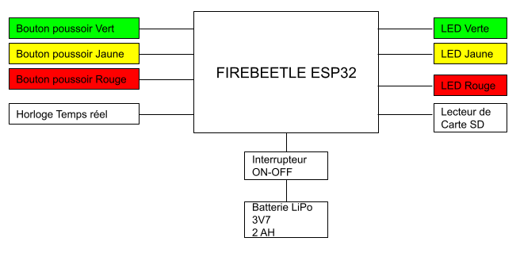

L'électronique de la borne de satisfaction s'articule autour de l'architecture composée :
- Une carte Firebeetle ESP32 (Processeur+Charge de la batterie)  
- 3 Boutons poussoirs pour le vote
- 3 Leds pour indiquer le bouton pressé au votant
- Un lecteur de carte SD et sa carte SD qui contient les résultats des votes
- Une horloge temps réelle pour indiquer l'horodatage des votes

### Architecture Principale ###
