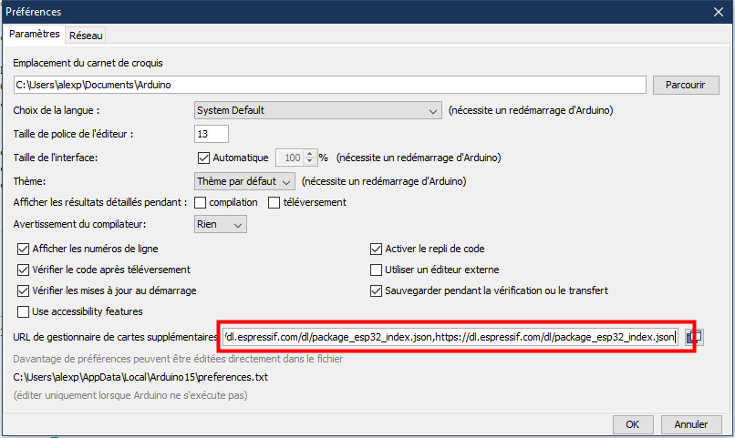
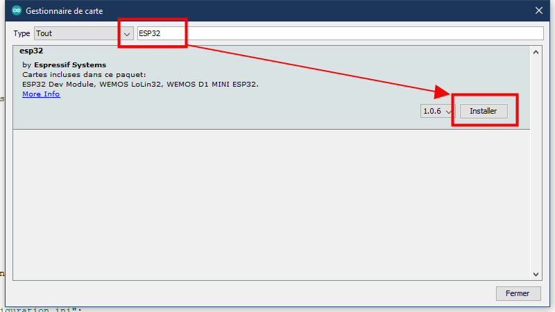
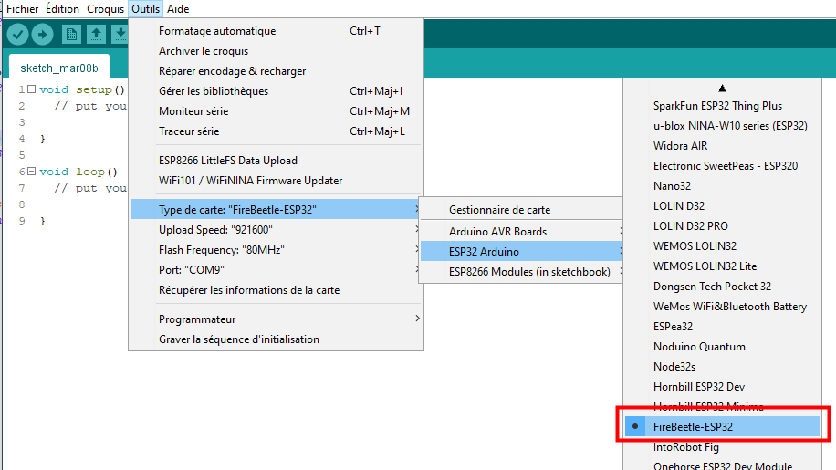
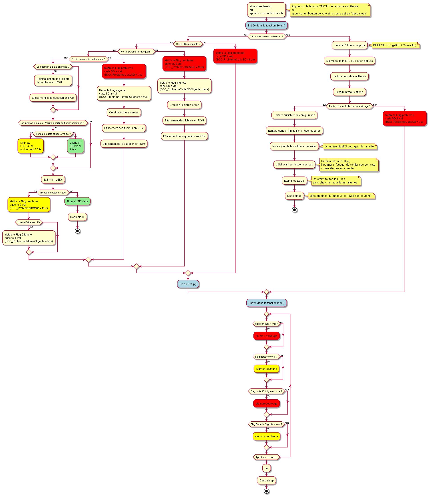

* TOC
{:toc}


---


# Compilation du programme #
Afin de pouvoir compiler le programme, il est nécessaire d'installer [l'IDE Arduino](https://www.arduino.cc/en/software) et les cartes ESP32.

## Installation des cartes ESP32 ##
Dans les préférences de l'IDE Arduino (Fichier>Préférences ou [Ctrl] + [,]), ajouter l'URL :
``` https://dl.espressif.com/dl/package_esp32_index.json ``` dans les URL de cartes suplémentaires (il est possible d'avoir plusieurs jeux de cartes, il faut les séparer par des virgules), comme sur l'image ci-dessous.


Ensuite, dans le menu Tools > Boards manager Recherchez "ESP32" et installez les cartes trouvées.



Dans le menu Tools > Boards, choississez la carte **FireBeetle-ESP32**


## Installation des librairies utiles à la compilation ##
Toutes les librairies utiles se [trouvent ici](./libs/README.md)


# Utilisation du programme #

Lors de sa première execution, le programme va générer un fichier de paramétrage vierge sur la carte SD. Une fois ce fichier modifié, vous pourrez :
- Mettre la borne à l'heure,
- Initialiser un ID pour la borne.
- Initialiser une question.

La borne est alors prète à enregistrer les réponses à la question. L'enregistrement se fait de plusieures façon dans différents fichiers stockés sur al acrte SD.


## Fichiers sur la carte SD ##
La carte SD contient plusieurs type de fichiers :
- Fichier de paramétrage (Modifiable par le **gestionnaire**)
- Fichier d'enregistrements des résultats (Généré par le programme).
- Fichier de synthèse des résultats (Généré par le programme).


### Format des fichiers ###

#### Fichier de paramétrage ####
fichier : **configuration.ini** formaté comme suit :
```
# Ceci est le fichier de configuration pour l'application 'Compteur de vote'.
# Ne modifiez pas le nom des variables (ce qui se trouve avant le signe egale sur une ligne).
# Vous pouvez modifier le texte se trouvant apres le signe egale a votre guise.
#____________________________________________________________________________________________
[config]

# Le siteID est votre identifiant comme il vous a ete donnee par l'enqueteur,
# ne le modifiez pas s'il ne vous le demande pas.
siteID=Cool Food UOF

# Cette phrase apparaitra dans le fichier resultat à votre questionnaire mais n'est pas visible sur la borne.
# Il est conseille de definir ici une phrase courte.
question=Aimez-vous faire des tests sur cette borne ?

# Si vous avez besoin de mettre la date à l'heure dans la borne, c'est ici.
# Pour la mise à l'heure, décommentez (supprimez le # en début de ligne) et 
# remplissez les champs suivant avec des valeurs numériques uniquement.
# Une fois la mise à l'heure faite, les lignes seront automatiquement commentées.
#year=2022
#month=04
#day=27
#hour=14
#minute=56
```


#### Fichier de synthèse ####
Fichier **YYYY-MM-DD_recap.txt** (par exemple 2022-04-27_recap.txt) formaté comme suit :


```
Etablissement = Cool Food I23I5V242Q
Date          = 2022/04/05
Question      = Voulez vous manger un plat végétarien une fois par semaine ?
Batterie      = 96%
Nombre d'appui sur les boutons :
  Rouge = 2
  Vert  = 4
  Jaune = 3
  TOTAL = 9
Pourcentage d'appui sur les boutons :
  Rouge = 22%
  Vert  = 44%
  Jaune = 33%

```


#### Fichiers CSV ####
Fichier **YYYY-MM-DD_detail.csv** (par exemple 2022-04-27_detail.csv) formaté comme suit :


Exemple d'un fichier 20220208_Mesures.csv

| ID du site | Date | Heure | Question | Vert | Rouge | Jaune | Niveau Batterie
| ---------- | ---- | ----- | -------- | --- | --- | ----------- | ---------------
| OpenFactory | 08/02/2022 | 12:45:52 | Aimez-vous les artichauds | 1 | 0 | 0 | 90%
| OpenFactory | 08/02/2022 | 12:45:53 | Aimez-vous les artichauds | 1 | 0 | 0 | 90%
| OpenFactory | 08/02/2022 | 12:45:55 | Aimez-vous les artichauds | 0 | 0 | 1 | 90%
| OpenFactory | 08/05/2022 | 20:12:15 | Aimez-vous les artichauds | 0 | 1 | 0 | 50%


## Codes couleur des LEDs ##
Les LEDS sont utilisées pour indiquer des alertes ou des erreurs lors de la mise sous tension de la borne.

| Couleur | Allumage LED  | Signification | Bloquant |
|---------|------|---------------|------|
| Rouge | Fixe | Carte SD manquante | Oui |
| Rouge | Clignotant | Fichier configuration manquante | Oui |
| Jaune | Bref | Niveau de batterie < 20% | Non  |
| Jaune | Clignotant | Niveau de batterie < 5% | Non  |
| Jaune | Clignotant (3x) | Echec de la mise à l'heure | Non  |
| Vert  | Clignotant (3x) | Date et heure mise à jour à partir du fichier de configuration | Non |
| Vert  | Bref | Tout est OK | Non |


## Algorithme du microcontrôleur ##

